# Credify

Credify is a modern testimonial collection platform built for small businesses and creators. Share a simple link with your clients, collect authentic feedback, and manage it seamlessly from one intuitive dashboard — no client login required.

## 🛠 Built With

* React.js

* Tailwind CSS

* Redux Toolkit

* React Hook Form + Zod

* Firebase Authentication

* Firebase Realtime Database

* Cloudinary

* Framer Motion

* ShadCN/UI

* Lucide React Icons

## ✨ Features

* Signup with company name, email & password

* Secure login system for businesses

* Shareable public link to collect testimonials

* No login required for clients

* Real-time testimonial submissions via Firebase

* Dashboard with testimonial count & recent entries

* Update company logo and description in profile

* Select from 4 templates (2 free, 2 premium)

* Upgrade to premium for advanced features

* Clean, responsive, animated UI using Framer Motion

# 📸 Preview

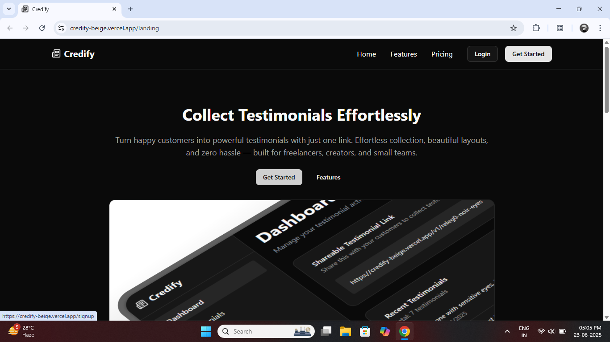
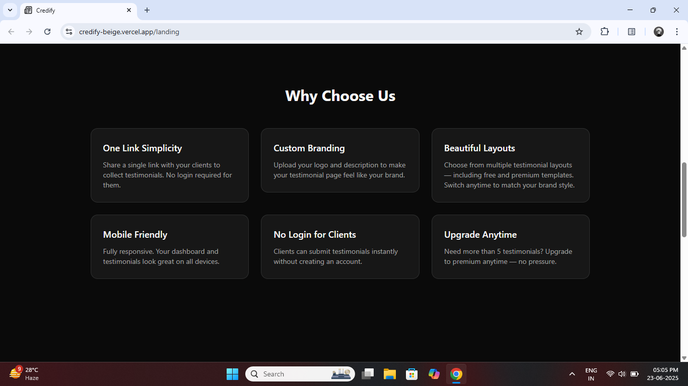
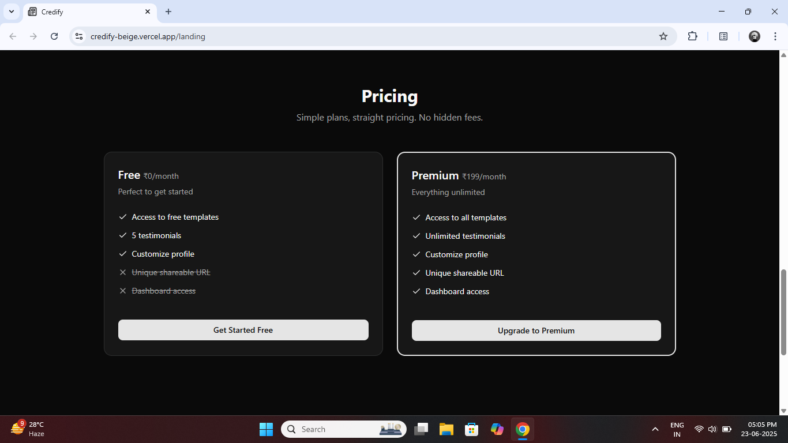
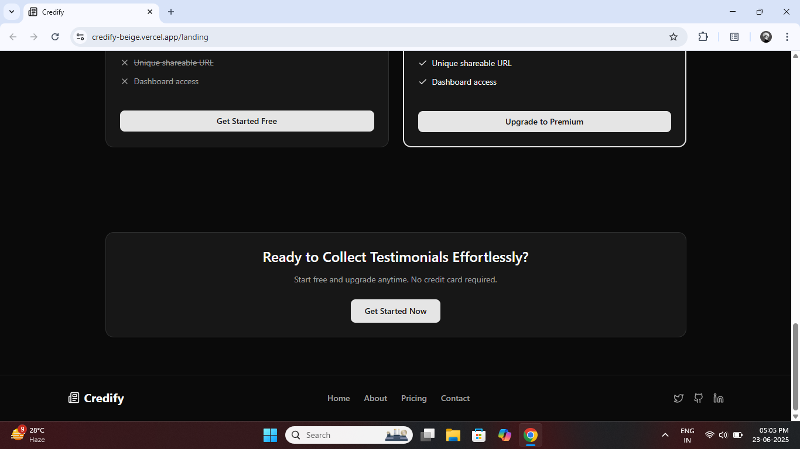
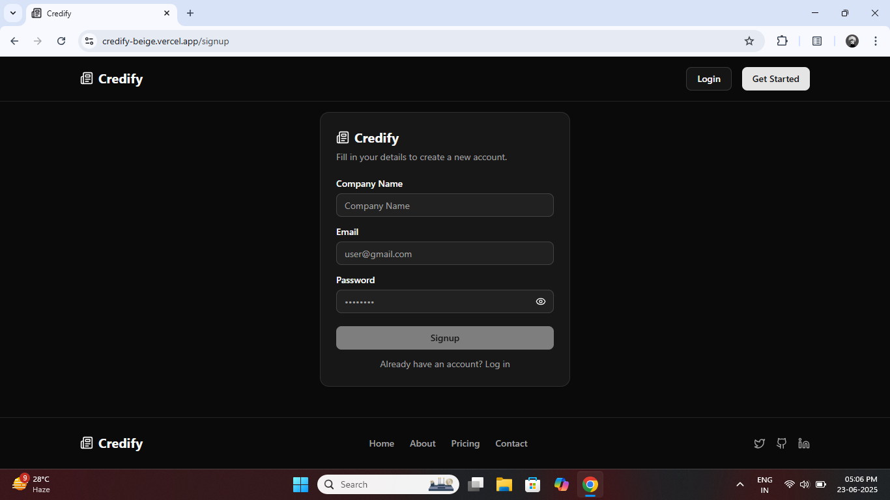
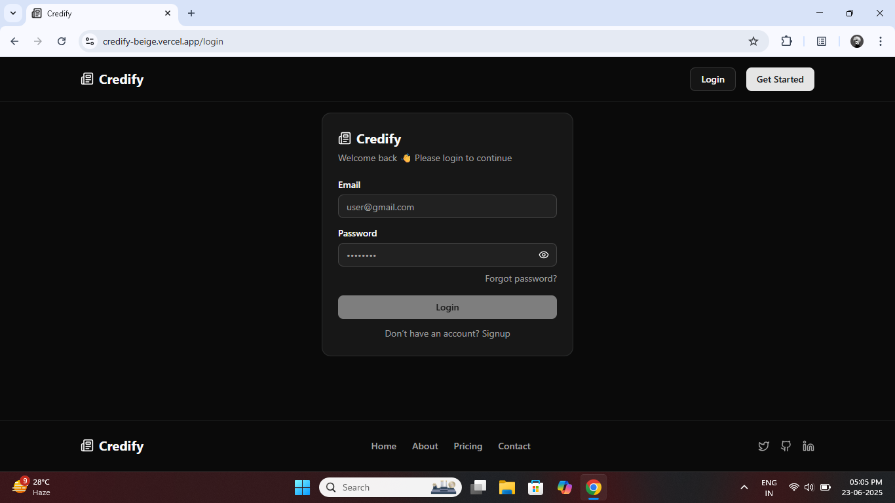
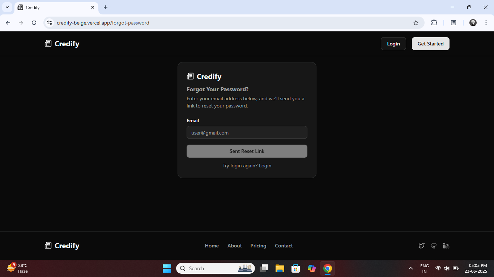
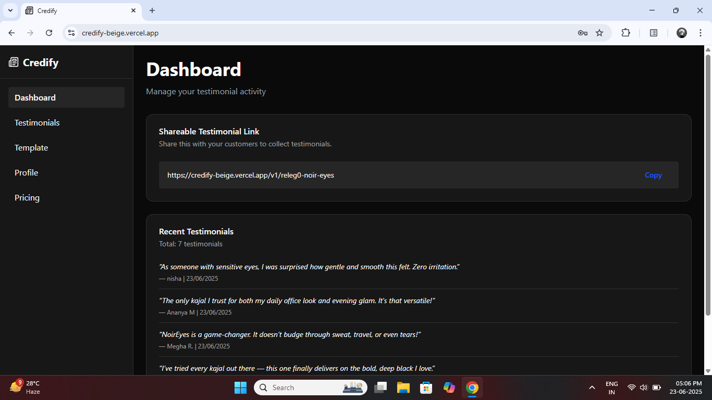
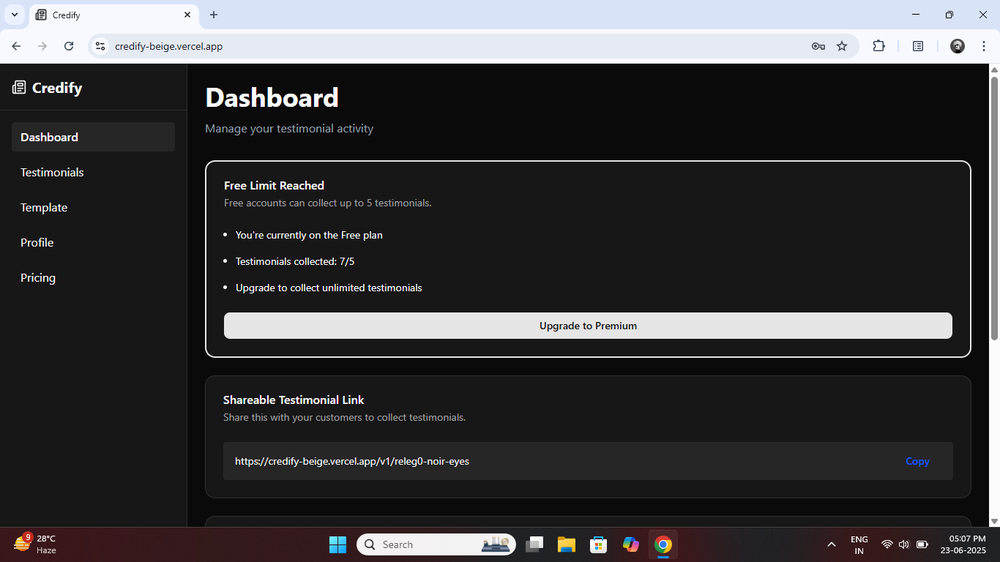
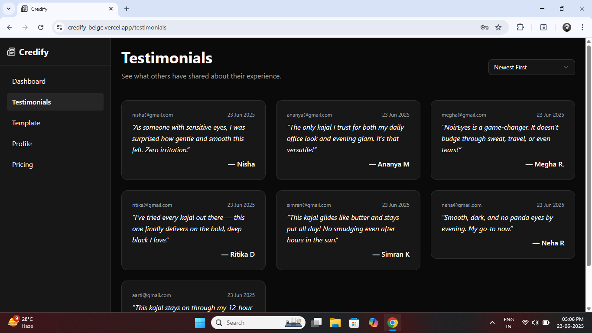
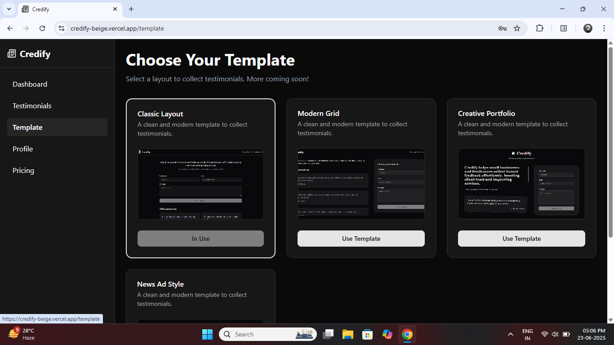
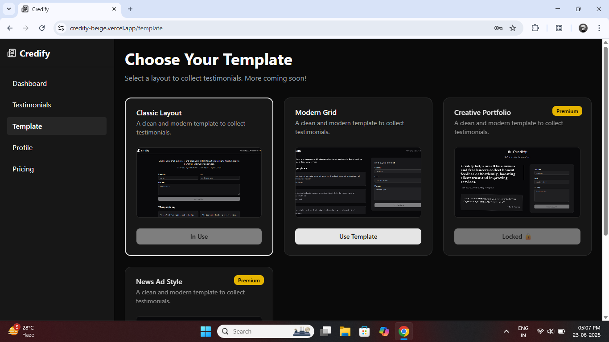
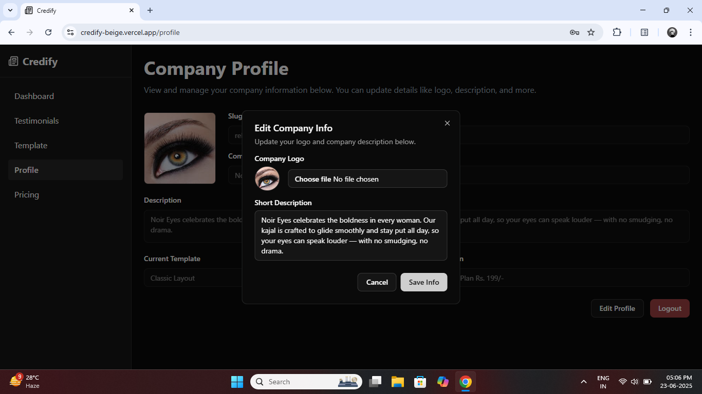
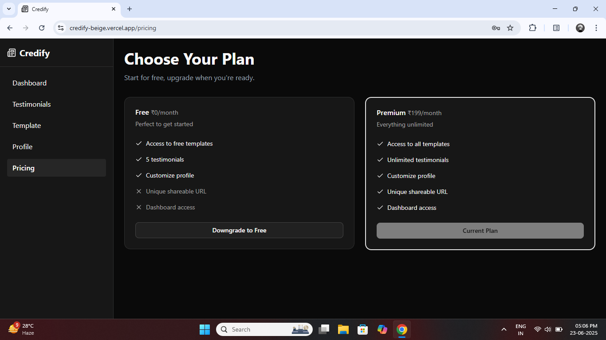
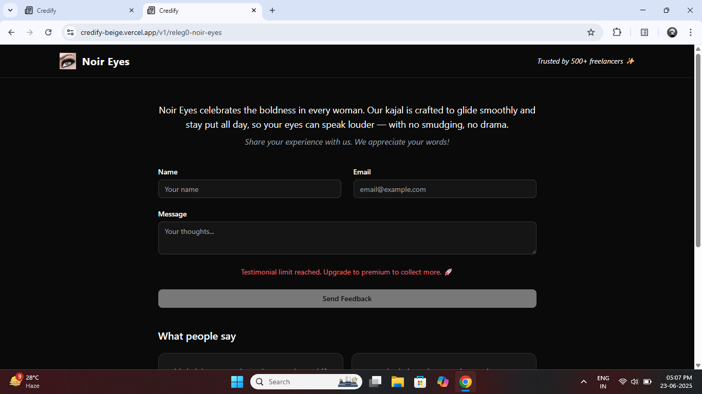
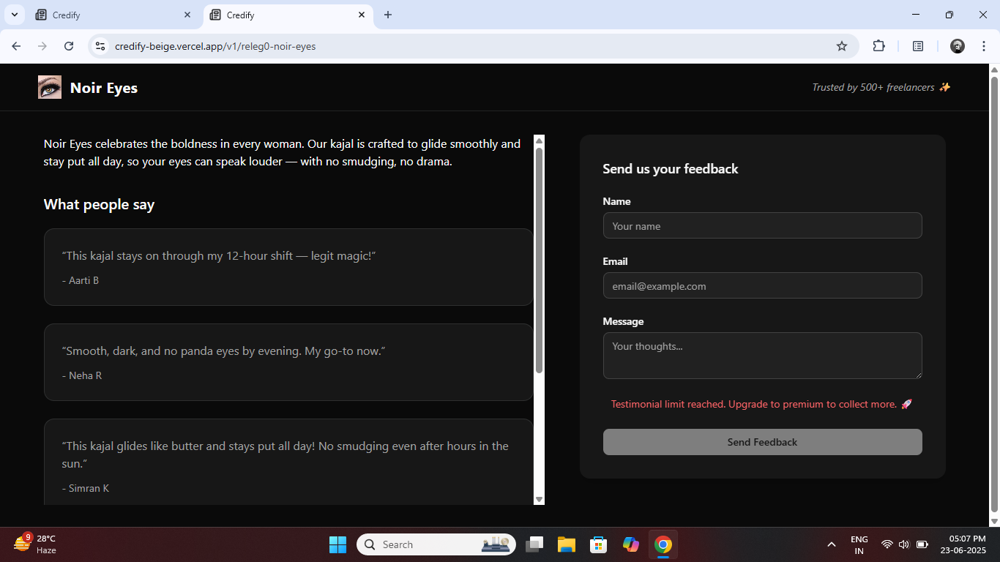
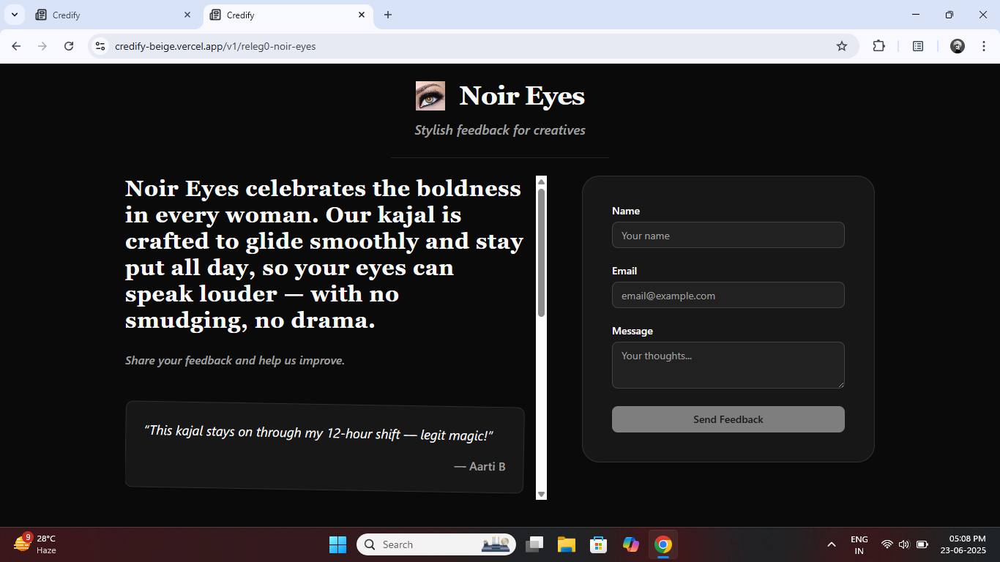
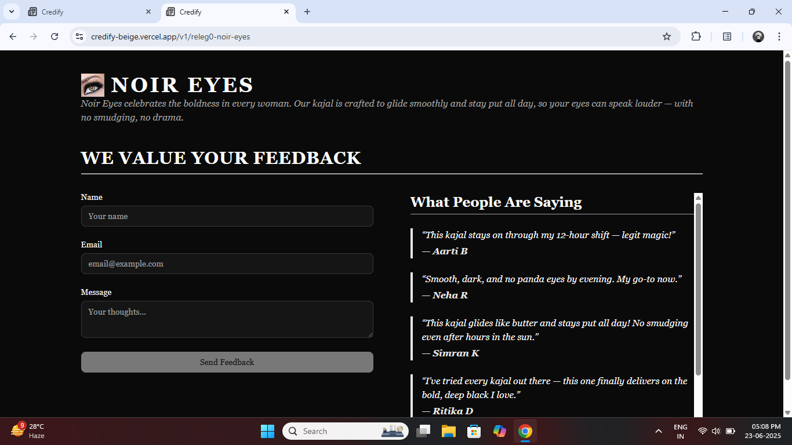